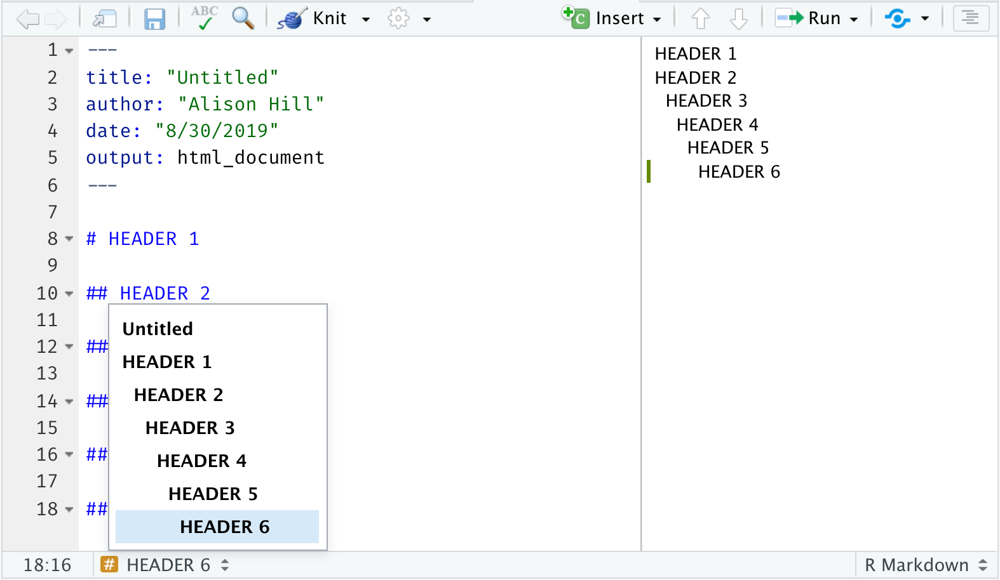

```{r setup, include=FALSE}
options(htmltools.dir.version = FALSE)
episode_counter <- 0
knitr::opts_chunk$set(
  collapse = TRUE,   
  comment = "#>"
)
```

```{r packages, include=FALSE}
library(countdown)
library(ymlthis)
library(tidyverse)
ggplot2::theme_set(ggplot2::theme_minimal())
```

```{r load-data, include=FALSE}
mockdata <- read_csv(here::here("static/slides/data/mockboston.csv")) 
```

class: title-slide, left, middle
background-image: url("images/renoir.jpg")
background-position: right
background-size: contain
background-color: #0071B8

.pull-left[

# `r rmarkdown::metadata$title`

## `r rmarkdown::metadata$subtitle`

### `r rmarkdown::metadata$author` &#183; RStudio

#### [r3-rmedicine.netlify.app](https://r3-rmedicine.netlify.app)
]


---
class: middle, center

# <i class="fas fa-cloud"></i>

# Go here and log in (free):

`r params$cloud_link`

---
layout: true

<div class="my-footer"><span>`r params$cloud_link`</span></div>

---
class: middle, center

# Who we are

.columns[

.left-col[
### Alison Hill


[`r fontawesome::fa("github")` @apreshill](https://github.com/apreshill)    
[`r fontawesome::fa("twitter")` @apreshill](https://twitter.com/apreshill)   
[`r fontawesome::fa("link")` alison.rbind.io](https://alison.rbind.io)
]

.middle-col[
### Stephan Kadauke


[`r fontawesome::fa("github")` @skadauke](https://github.com/skadauke)   
[`r fontawesome::fa("twitter")` @StephanKadauke](https://twitter.com/StephanKadauke)
]


.right-col[
### Paul Villanueva


[`r fontawesome::fa("github")` @pommevilla](https://github.com/pommevilla)    
[`r fontawesome::fa("twitter")` @pommevilla](https://twitter.com/pommevilla)  
[`r fontawesome::fa("link")` pommevilla.rbind.io](https://pommevilla.rbind.io/)
]
]

---
background-image: url(images/deardata.jpg)
background-size: 50%

.footnote[https://www.dear-data.com/]

---
class: center
background-image: url(https://media.giphy.com/media/11fDMHAzihB8D6/source.gif)

# Reproducibility crisis? 

???

We are not here today to solve science or medicine's reproducibility crisis.

What I do think R Markdown can help you with today when you leave here is to tackle two other crises: one I think of as the confidence crisis...

---
class: center
background-image: url(https://media.giphy.com/media/OPZZ6KWJOZ3AA/source.gif)

# Confidence crisis

---
class: center
background-image: url(https://dickbrouwer.com/img/meeting_cheese.png)
background-size: contain

# `r emo::ji("cheese")` Cheese crisis `r emo::ji("cheese")`

.footnote[https://dickbrouwer.com/blog/a-guide-to-better-meetings/]

---
class: middle, center

# Change your mental model

.pull-left[

### Source &harr; output

```{r echo=FALSE, out.width="50%"}
knitr::include_graphics("images/word.png")
```

]

.pull-right[

### Source &rarr; output

```{r echo=FALSE, out.width="50%"}

```

]

---
class: middle

.pull-left[

| Time (PDT)      | Activity                                |
|:----------------|:----------------------------------------|
| 12:30 - 01:20pm | Session 1 (Basics)                      |
| 01:20 - 01:30pm | *Break* `r emo::ji("coffee")`           |
| 01:30 - 02:20pm | Session 2 (Authoring)                   |
| 02:20 - 02:30pm | *Break* `r emo::ji("tea")`              |
| 02:30 - 03:20pm | Session 3 (Projects & Workflows)        |
| 03:20 - 03:30pm | *Break* `r emo::ji("potable_water")`    |
| 03:30 - 04:00pm | Wrap-up / Q & A                         |
]

--

.pull-right[
Format:

+ Live demos / slides
+ Solo activities called "Your Turns" (with timer)
+ No group activities
+ Video on or off
+ Choose your own adventure style

]

---
class: middle, left, inverse
background-image: url(images/01-explore.png)
background-position: right
background-size: contain

# Live demo: 

### RStudio Cloud

---
class: your-turn

# Your turn

Open up the file `01-explore.qmd`.

Try to identify these parts in the source:

1. The **metadata**

1. The **text** 

1. The **code**

**If this was easy**, try to find all code that produces a *plot*.

_psst...`01-explore-alison-params.qmd` is also there..._

```{r echo = FALSE}
countdown(minutes = 2)
```

---
class: inverse

# Basic anatomy: source

We look at the source anatomy for `01-explore.qmd` together:

1. The **metadata**

1. The **text** 

1. The **code**

---
background-image: url(https://media.giphy.com/media/L2qukNXGjccyuAYd3W/giphy.gif?cid=790b76111a5dd3955457a4d3d0e9af2155a499ed56980b4e&rid=giphy.gif&ct=g)

---
class: inverse, center, middle

# We are using Quarto

---
background-image: url(https://media.giphy.com/media/d3mlPd7WETdWajCg/giphy.gif?cid=790b76116f9fa682cadbdd5172881710096d429f49efc369&rid=giphy.gif&ct=g)

---
class: middle, center, inverse

```{r echo=FALSE}
knitr::include_url("https://quarto.org")
```

---
background-image: url(https://media.giphy.com/media/26gs6ASI0ExbUXq0g/giphy.gif?cid=790b7611b5a33442a8ef1fb752428b0364020b5606646756&rid=giphy.gif&ct=g)

---
background-image: url(https://media.giphy.com/media/26Do4GhHgmdCR0Uq4/giphy.gif?cid=790b7611938d81930e55cd8f0b4b88b6dd9d4827d9fca53c&rid=giphy.gif&ct=g)

---
class: middle, center
background-image: url(images/Pandoc.jpg)
background-size: contain
background-position: right
background-color: #fff

.columns[

.left-col[

## What is Quarto?

]
]

---
background-image: url(images/hexes.png)
background-size: contain
background-position: left
class: left, middle
background-color: #fff

.pull-right[
# What is Quarto?

+ A command line interface (CLI) installed at your terminal (not an R package!)
    + <https://quarto.org/docs/getting-started/installation.html>
    
+ Built in RStudio support with a daily version build
    + <https://quarto.org/docs/tools/rstudio.html>
]

---
background-image: url(images/py-alone.png)
background-size: contain


# Why Quarto?

---
class: middle, center
background-image: url(images/py-together.png)
background-size: contain


---
background-image: url(images/quarto-how.png)
background-size: contain
background-position: bottom
class: center, top
background-color: #fff

# How does it work?

---
background-image: url(images/render.png)
class: middle center
background-position: 50% 60%

# Hello, Quarto!

---
class: middle, left, inverse
background-image: url(images/01-explore-html.png)
background-position: right
background-size: contain

# Live demo: 

### We render together

---
class: inverse

# Basic anatomy: output

We look at the output anatomy for `01-explore.qmd` together:

1. The **metadata**

1. The **text** 

1. The **code**

1. The **output**

---
name: card0
background-image: url(images/card0.png)
background-size: contain

.footnote[https://www.dear-data.com/]

---
name: card1
background-image: url(images/card1.png)
background-size: contain

.footnote[https://www.dear-data.com/]

---
name: card2
background-image: url(images/card2.png)
background-size: contain

.footnote[https://www.dear-data.com/]

---
name: card3
background-image: url(images/card3.png)
background-size: contain

---
background-image: url(images/card4.png)
background-size: contain

---
class: middle, center
background-color: #fff

# What is inside?


---
class: inverse, center, middle

<span class="fa-stack fa-4x">
  <i class="fa fa-circle fa-stack-2x" style="color: #fff;"></i>
  <strong class="fa-stack-1x" style="color:#121A54;">`r (episode_counter <- episode_counter + 1)` </strong>
</span> 

--

# Text

---
class: middle, left, inverse
background-image: url(https://quarto.org/docs/visual-editor/images/visual-editing.png)
background-position: right
background-size: contain

# Live demo: 

### Quarto visual editor (Paul V)

https://quarto.org/docs/visual-editor/

---

# <center>Headers</center>

--

.pull-left[
```markdown
# HEADER 1

## HEADER 2

### HEADER 3

#### HEADER 4

##### HEADER 5

###### HEADER 6
```
]

--

.pull-right[
# HEADER 1

## HEADER 2

### HEADER 3

#### HEADER 4

##### HEADER 5

###### HEADER 6
]

---



---

# <center>Text</center>

--

.pull-left[
```markdown
Childhood **vaccines**  
are one of the  
_great triumphs_  
of modern medicine. 
```
]

--

.pull-right[

Childhood **vaccines**  
are one of the  
_great triumphs_  
of modern medicine. 

]

---
class: top

# <center>Bulleted Lists</center>

--

.pull-left[

```markdown
Indeed, parents whose children are  
vaccinated no longer have to worry about  
their child's death or disability from:

- whooping cough, 
- polio, 
- diphtheria, 
- hepatitis, or 
- a host of other infections.
```

]

--

.pull-right[

Indeed, parents whose children are  
vaccinated no longer have to worry about  
their child's death or disability from:

- whooping cough, 
- polio, 
- diphtheria, 
- hepatitis, or 
- a host of other infections.

]

---
class: top

# <center>Numbered Lists</center>

--

.pull-left[

```markdown
Vaccines are the most cost-effective  
health care interventions there are.  
We have three new, extremely effective  
vaccines to roll out in developing  
countries:  

1. pneumonia
1. rotavirus
1. meningitis A
```

]

--

.pull-right[

Vaccines are the most cost-effective  
health care interventions there are.  
We have three new, extremely effective  
vaccines to roll out in developing  
countries:  

1. pneumonia
1. rotavirus
1. meningitis A

]


---

# <center>Images</center>

--

.pull-left[
```markdown
Receiving rubella vaccination, Brazil, 2008.

```
]

--

.pull-right[
Receiving rubella vaccination, Brazil, 2008.

]

---

# <center>Links</center>

--

.pull-left[
```markdown
[Photo](https://en.wikipedia.org/wiki/Vaccine)

Receiving rubella vaccination, Brazil, 2008.

```
]

--

.pull-right[
[Photo](https://en.wikipedia.org/wiki/Vaccine)

Receiving rubella vaccination, Brazil, 2008.

]

---
class: middle

# Check-in

--

.pull-left[

How do you add headers in Markdown?

`! Header`

`- Header`

`# Header`

`1. Header`

]

--

.pull-right[

What about lists? Bulleted? Numbered?

`! Item 1`

`- Item 1`

`# Item 1`

`1. Item 1`

]

---

# Your turn

Find this section:

```markdown
<--TODO: add markdown table of treatment arms here-->
```

Using the visual markdown editor, make this table:

| Arm | Drug   |
|:----|:-------|
| A   | IFL    |
| F   | FOLFOX |
| G   | IROX   |


_psst...markdown on the next slide..._

```{r echo=FALSE}
countdown(minutes = 3)
```

---

# Your turn

## Markdown versions

.pull-left[
```markdown
| Arm | Drug   |
|:----|:-------|
| A   | IFL    |
| F   | FOLFOX |
| G   | IROX   |
```
]

.pull-right[
```markdown
|Arm|Drug|
|:---|:---|
|A|IFL|
|F|FOLFOX|
|G|IROX|
```
]

Spacing actually doesn't matter - it mainly helps your eyeballs.

---
class: inverse, center, middle

<span class="fa-stack fa-4x">
  <i class="fa fa-circle fa-stack-2x" style="color: #fff;"></i>
  <strong class="fa-stack-1x" style="color:#121A54;">`r (episode_counter <- episode_counter + 1)` </strong>
</span> 

--

# <i class="fab fa-r-project"></i> code

---

# Code chunks

.pull-left[

````
```{r}`r ''`
mockdata %>% 
  distinct(arm)
```
````

What is the fate of this chunk?

]

--

.pull-right[

```{r}
mockdata %>% 
  distinct(arm)
```

]

---

# Code chunks

.pull-left[

````
```{r}`r ''`
n_sites <- n_distinct(mockdata$site)
```
````

What fate do you predict here?

]

--

.pull-right[

```{r}
n_sites <- n_distinct(mockdata$site)
```

  
]

---

# Code chunks

.pull-left[

````
```{r}`r ''`
n_sites <- n_distinct(mockdata$site)
n_sites
```
````

]

--

.pull-right[

```{r}
n_sites <- n_distinct(mockdata$site)
n_sites
```

  
]

---

# Code chunks

.pull-left[

````
```{r}`r ''`
ggplot(mockdata, aes(x = arm, 
                     y = n, 
                     fill = arm)) +
  geom_col()
```
````

What about this one?

]

--

.pull-right[

```{r fig.retina=3, out.width="70%", fig.align='center'}
ggplot(mockdata, aes(x = arm, 
                     y = n, 
                     fill = arm)) +
  geom_col()
```

]

---

# Add chunks

button or

Command (or Cmd) `⌘` + Option (or Alt) `⌥` +  `i` (Mac)

Ctrl + Alt + `i` (Windows/Linux)

---

# Run chunks

.pull-left[
interactively (show button)
]

.pull-right[
whole doc (knit button or run all chunks or )
]

---
class: inverse, center, middle

<span class="fa-stack fa-4x">
  <i class="fa fa-circle fa-stack-2x" style="color: #fff;"></i>
  <strong class="fa-stack-1x" style="color:#121A54;">`r (episode_counter <- episode_counter + 1)` </strong>
</span> 

--

# Output

---

# Chunk options

.pull-left[

````
```{r}`r ''`
glimpse(mockdata)
```
````

]

.pull-right[

```{r}
glimpse(mockdata)
```

]

---

# echo

.pull-left[

````
```{r}`r ''`
#| echo: FALSE
glimpse(mockdata)
```
````


Same as:

````
```{r echo=FALSE}`r ''`
glimpse(mockdata)
```
````

]

.pull-right[

```{r echo=FALSE}
glimpse(mockdata)
```

]

---

# eval

.pull-left[

````
```{r}`r ''`
#| eval: FALSE
glimpse(mockdata)
```
````

Same as:

````
```{r eval=FALSE}`r ''`
glimpse(mockdata)
```
````

]

.pull-right[

```{r eval=FALSE}
glimpse(mockdata)
```

]

---

# include

.pull-left[

````
```{r}`r ''`
#| include: FALSE
glimpse(mockdata)
```
````

Same as:

````
```{r include=FALSE}`r ''`
glimpse(mockdata)
```
````

]

.pull-right[

```{r include=FALSE}
glimpse(mockdata)
```

]

---

# Combining chunk options

.pull-left[

````
```{r}`r ''`
#| echo: TRUE
#| results: 'hide'
glimpse(mockdata)
```
````

Same as: 

````
```{r echo=TRUE, results='hide'}`r ''`
glimpse(mockdata)
```
````

Careful! The `r` part is the **code engine** (other engines possible)

]

.pull-right[

```{r echo=TRUE, results='hide'}
glimpse(mockdata)
```


]

---

# message / warning


---

# message / warning

.pull-left[

````
```{r}`r ''`
#| message: FALSE
#| warning: FALSE
library(tidyverse)
```
````

]

.pull-right[

```{r message=FALSE, warning=FALSE}
library(tidyverse)
```

]


---

# Combining chunk options

.pull-left[

````
```{r}`r ''`
#| echo: TRUE
#| results: 'hide'
glimpse(mockdata)
```
````

+ Place after a hash-pipe <br>`#|`

+ Stack multiples 

+ Uses colon `:`

]

.pull-right[
````
```{r echo=TRUE, results='hide'}`r ''`
glimpse(mockdata)
```
````

+ Place between curly braces<br>`{r option=value}`

+ List multiples separated by commas<br>`{r option1=value, option2=value}`

+ Uses equal sign `=`

]

---

.left-column[
# Default options
]

.right-column[
```{r}
str(knitr::opts_chunk$get())
```

]


---
class: middle, center, inverse

<span class="fa-stack fa-4x">
  <i class="fa fa-circle fa-stack-2x" style="color: #fff;"></i>
  <strong class="fa-stack-1x" style="color:#121A54;">`r (episode_counter <- episode_counter + 1)` </strong>
</span> 

--

# Metadata

---

# metadata: YAML

.pull-left[

_"YAML Ain't Markup Language"_


```yaml
---
key: value
---
```

]

.pull-right[

```{r echo=FALSE, out.width="75%", fig.align='center'}
knitr::include_graphics("images/orchestra.jpg")
```

]

---
class: middle, center

# Execution options

---

# Execution options

Set globally for the whole document.

.pull-left[

```.yaml
---
execute:
  echo: false
  messages: false
  warning: false
  out.width: "100%" 
---
```

]

.pull-right[

+ Use `execute` in your YAML to cement

+ You can (and should) use individual chunk options too

+ No need for a `knitr` setup chunk!

]


---
class: middle, center

# Output formats


---
class: your-turn

# Your turn

## Use a different built-in format


Inside `01-explore.qmd`, edit the YAML to include Word `docx`:

```yaml
---
format:
  docx: default
  html: default
---
```

Render, and follow the steps to preview it.

Note: Our version of RStudio here is not updating the Render button properly. This *does* happen on desktop!


```{r echo = FALSE}
countdown(minutes = 2)
```

---
class: middle, center

# Output options

---

# Save output options in your YAML

.pull-left[

```.yaml
---
title: 'Explore mockstudy data'
author: Paul Villanueva
format: html
---
```

```.yaml
---
title: 'Explore mockstudy data'
author: Paul Villanueva
format: 
  html:
    toc: true
---
```


]

.pull-right[

```{r echo=FALSE, out.width="75%", fig.align='center'}
knitr::include_graphics("images/orchestra.jpg")
```

]
---
class: middle

# Check-in

.pull-left[
How do you use a **single** format?

(a)
```yaml
format: html
```
(b)
```yaml
output: html_document
```

]

--

.pull-right[
How do you set **options** for a format?

(a)
```yaml
format: 
  html: 
    toc: true
```

(b)
```yaml
output: 
  html_document(toc=true)
```

]

---
class: middle

# Check-in

.pull-left[
How do you add another output **format**?

(a)
```yaml
format: 
  html: default
  docx: default
```
(b)
```
output: 
  html_document()
  word_document()
```

]

--


.pull-right[
How do you add output **options** to one format?

(a)
```yaml
format: 
  html: 
    toc: true
  docx: default
```
(b)
```
output: 
  html_document(toc=true)
  word_document(default)
```

]


---

# Your turn: Edit your YAML

Move the `html` format to the top (above `docx`), then use the linked Quarto docs to:

1. Add a [table of contents](https://quarto.org/docs/output-formats/html-basics.html#table-of-contents)

1. Add [commenting](https://quarto.org/docs/output-formats/html-basics.html#commenting)

1. Add a [theme](https://quarto.org/docs/output-formats/html-themes.html)

1. Add [code tools](https://quarto.org/docs/output-formats/html-code.html#code-tools)

**Render** to HTML to see the output.

**If this was all easy**, try adding [code folding](https://quarto.org/docs/output-formats/html-code.html#folding-code) (*hint: make sure `echo: true` *)

_psst...answers on the next slide..._

```{r echo = FALSE}
countdown(minutes = 5)
```

---

# Answers

```yaml
---
execute:
  echo: true
  messages: false
  warning: false
format: 
  html:
    theme: "lux"
    toc: true
    code-fold: true
    code-summary: "Show the code"
    code-tools: true
---
```

---

# What is hard about YAML?

.pull-left[

]

.pull-right[
+ Indentations matter

+ Rarely informative error messages

+ Knowing which output options are relevant for different formats (i.e., Word, PDF, HTML, etc.)

+ Easy to forget the right `key`

+ Easy to forget the possible `values` for a given `key`
]


---
class: your-turn

# Your turn:New data dump! `r emo::ji("newspaper")`

Data from more sites just came in &mdash; we now have data for Boston, Seattle, and Denver.

1. Replace `mockboston` in the file `mockbsd`. 

1. **Render** to HTML. Do you see data for all 3 sites?

1. Clean up the chunks (split, combine, use options as you see fit)

1. Use the RStudio outline pane; rejoice!

**If this was easy**, try to use a parameter for the data file.

_psst...`01-explore-alison-params.qmd` is still there..._


```{r echo = FALSE}
countdown(minutes = 5)
```

---
class: middle, center

# Take-aways

--

`r emo::ji("heavy_check_mark")` **Document your document:** use YAML to set up meaningful metadata

--

`r emo::ji("heavy_check_mark")` **Style your document:** use YAML to add formats and options 

--

`r emo::ji("heavy_check_mark")` **Organize your text:** use markdown headers with `#`

--

`r emo::ji("heavy_check_mark")` **Organize your code:** use `knitr` chunk labels

--

`r emo::ji("heavy_check_mark")` **Style your text:** use markdown **bold**, _italics_, <i class="fas fa-list-ul"></i> bullets, and <i class="fas fa-list-ol"></i> lists

--

`r emo::ji("heavy_check_mark")` **Style your output:** use `knitr` chunk options

--

Render early, render often


---
class: middle, center

# `r emo::ji("stopwatch")`

# Time for a break!

```{r echo = FALSE}
countdown(minutes = 10, update_every = 15)
```


