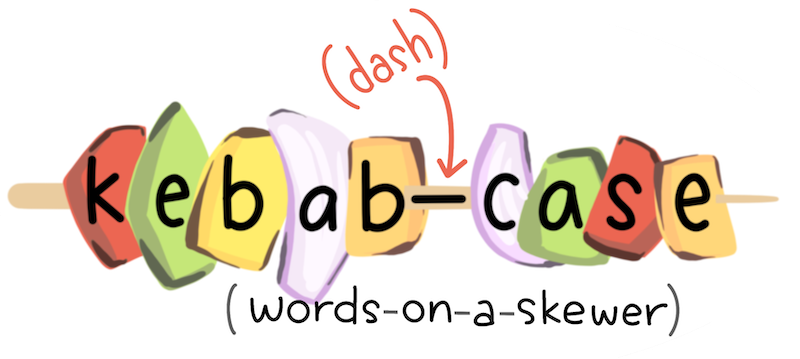

```{r setup, include=FALSE}
options(htmltools.dir.version = FALSE)
episode_counter <- 0
knitr::opts_chunk$set(
  collapse = TRUE,   
  comment = "#>"
)
options(knitr.table.format = "markdown")
```

```{r packages, include=FALSE}
library(countdown)
library(ymlthis)
library(tidyverse)
library(janitor)
library(scico)
```

```{r load-data, include=FALSE}
mockdata <- read_csv(here::here("static/slides/data/mockdata.csv")) %>%
  mutate(fu_fct = fct_recode(as.factor(fu_stat), 
                             "Lived" = "1", 
                             "Died" = "2")) %>% 
  mutate_at(vars(starts_with("ae_")), ~as.factor(.))
```


class: title-slide, left, middle
background-image: url("images/renoir.jpg")
background-position: right
background-size: contain
background-color: #0071B8

.pull-left[

# `r rmarkdown::metadata$title`

## `r rmarkdown::metadata$subtitle`

### `r rmarkdown::metadata$author` &#183; RStudio

#### [r3-rmedicine.netlify.app](https://r3-rmedicine.netlify.app)
]


---
class: middle, center

# <i class="fas fa-cloud"></i>

# Go here and log in (free):

`r params$cloud_link`

---
layout: true

<div class="my-footer"><span>`r params$cloud_link`</span></div>

---

# Your turn

**WARM-UP**: open `02-draft.qmd` and read the source file. It has several figures coded using the `ggplot2` package. Look at the source and answer the following questions:

1. What is the output **format**?

1. Are there any output **options**?

1. Are any `knitr` **execution** options set?

1. Anything in the code look foreign to you? 

Finally, render this file. Anything in the output (or not in the output) surprise you?

```{r echo = FALSE}
countdown(minutes = 5)
```

---
class: middle, center, inverse

<span class="fa-stack fa-4x">
  <i class="fa fa-circle fa-stack-2x" style="color: #fff;"></i>
  <strong class="fa-stack-1x" style="color:#2f5275;">`r (episode_counter <- episode_counter + 1)` </strong>
</span> 

--

# Figures

---
```{r load-data2, include=FALSE}
mockdata <- read_csv(here::here("static/slides/data/mockdata.csv")) %>%
  mutate(fu_fct = fct_recode(as.factor(fu_stat), 
                             "Lived" = "1", 
                             "Died" = "2")) %>% 
  mutate_at(vars(starts_with("ae_")), ~as.factor(.))
```

```{r include = FALSE, fig.show="hold", out.width='25%', echo = FALSE, fig.retina=3}
source('figs.R')
age_histogram
surv_pct_plot
surv_days_plot
ae_pct_plot
```


# Including plots

```{r age-hist-print1, include=FALSE}
# PLOT: Age distribution -------------------------------------------------------
ggplot(mockdata, aes(age)) +
  geom_histogram(color = 'white',
                 fill = scico(1, 
                              begin = .3, 
                              palette = "berlin"),
                 bins = 20) +
  labs(x = "Age", 
       y = "Count") +
  scale_y_continuous(
    breaks = scales::pretty_breaks()
  )
```

.pull-left[

Will this print?

```{r ref.label='age-hist-print1', echo=TRUE, fig.show='hide'}
```

]

--

.pull-right[

```{r ref.label='age-hist-print1', echo=FALSE, fig.retina=3}
```

]

---

# Including plots

```{r age-hist, include=FALSE}
# PLOT: Age distribution -------------------------------------------------------
age_histogram <- 
  ggplot(mockdata, aes(age)) +
  geom_histogram(color = 'white',
                 fill = scico(1, 
                              begin = .3, 
                              palette = "berlin"),
                 bins = 20) +
  labs(x = "Age", 
       y = "Count") +
  scale_y_continuous(
    breaks = scales::pretty_breaks()
  )
```

.pull-left[

What about this?

```{r ref.label='age-hist', echo=TRUE}
```

]

--

.pull-right[
```{r ref.label='age-hist', echo=FALSE}
```

]


---

# Including plots

```{r age-hist-print, include=FALSE}
# PLOT: Age distribution -------------------------------------------------------
age_histogram <- 
  ggplot(mockdata, aes(age)) +
  geom_histogram(color = 'white',
                 fill = scico(1, 
                              begin = .3, 
                              palette = "berlin"),
                 bins = 20) +
  labs(x = "Age", 
       y = "Count") +
  scale_y_continuous(
    breaks = scales::pretty_breaks()
  )
age_histogram
```

.pull-left[

What about this?

```{r ref.label='age-hist-print', echo=TRUE, fig.show='hide'}
```

]

--

.pull-right[

```{r ref.label='age-hist-print', echo=FALSE, fig.retina=3}
```

]

???


so, how did we get a figure into R Markdown?

Answer: it has to print!

---

# Chunk options for plots

- fig resolution
- fig size (`fig.width`, `fig.height`, `fig.asp`)
- [fig "device"](https://r4ds.had.co.nz/graphics-for-communication.html#other-important-options)

See also:

https://r4ds.had.co.nz/graphics-for-communication.html#figure-sizing

.footnote[https://yihui.name/knitr/options/#plots]

---

# out.width

.pull-left[

````
```{r}`r ''`
#| out.width="70%"
age_histogram
```
````

```{r ref.label='age-hist-print', echo=FALSE, out.width="70%", fig.retina=3}
```

]

--

.pull-right[

````
```{r}`r ''`
#| out.width="10%"
age_histogram
```
````

```{r ref.label='age-hist-print', echo=FALSE, fig.retina=3, out.width="10%"}

```


]
---

# fig-cap

.pull-left[

````
```{r fig-age}`r ''` 
#| echo: FALSE
#| fig-cap: 'Age distributions'
age_histogram
```
````

]

.pull-right[

```{r fig-age, echo = FALSE, fig.retina = 3, out.width="50%"}
age_histogram
```

**Fig. 1:** Age distributions

]


---

# Chunk labels

.pull-left[

````
```{r}`r ''`
#| label: peek
#| echo: FALSE
#| results: 'hide'
glimpse(mockdata)
```
````

Place either:

+ On a separate line after `#| label:`
+ In chunk header after `r`

]

.pull-right[

+ Careful! No duplicate chunk labels

    ````
    ```{r peek}`r ''`
    head(mockdata)
    ```
    ````

    ```
    Error in parse_block(g[-1], g[1], params.src) : 
      duplicate label 'peek'
    Calls: <Anonymous> ... process_file -> split_file -> lapply -> FUN -> parse_block
    Execution halted
    ```

]

???

how can we make it easier on ourselves to explore the code in here?

show how to add chunk labels and view in IDE interactively

---
class: middle, center

# Chunks as house plants or crops?

.footnote[https://masalmon.eu/2017/08/08/chunkpets/]

---
class: middle, center

# A good chunk label

.pull-left[

### Good

`myplot`

`my-plot`

`myPlot`

`myplot1`


]

.pull-right[

### Bad

`my_plot`

`my plot`

everything else!


]

---
background-color: #fff
class: middle, center

# Think: kebabs, not snakes

.pull-left[

]

.pull-right[

]
---

# Cross-reference a figure

.pull-left[

See Figure `@fig-age`.

````
```{r fig-age}`r ''`
#| echo: FALSE
#| fig-cap: 'Age distributions'
age_histogram
```
````

]

.pull-right[

See Figure [1]().

.center[

```{r ref.label = 'fig-age', out.width='70%', echo = FALSE, fig.retina = 3, fig.cap='Age distributions'}
```

]

]

---
class: middle, center

# Key takeaway

Once you have:

`r emo::ji("heavy_check_mark")` A labeled chunk that produces a plot

`r emo::ji("heavy_check_mark")` AND the plot label starts with `fig-`

`r emo::ji("heavy_check_mark")` AND a figure caption using `fig-cap` (**not `fig.cap`**)

Then you can have:

### Cross-references! In any format.

---
class: inverse, middle

# Live code demo

We open up `02-draft.Rmd` and take the static image and together we:

1. Label that chunk like `fig-bmj`

1. Add a cross-reference like `see Figure @fig-bmj`

1. Try again with `counts-by-site` code chunk: `see Figure @fig-counts-by-site` _(watch what happens if try to cross-reference without a caption, or use a chunk label that does not start with `fig-`!)_


---
class: middle, center, inverse

<span class="fa-stack fa-4x">
  <i class="fa fa-circle fa-stack-2x" style="color: #fff;"></i>
  <strong class="fa-stack-1x" style="color:#2f5275;">`r (episode_counter <- episode_counter + 1)` </strong>
</span> 

--

#  Layouts

---
class: middle, center

# The line-up

```{r fig.show="hold", out.width='25%', echo = FALSE, fig.retina=3}
age_histogram
surv_pct_plot
surv_days_plot
ae_pct_plot
```


---
class: inverse, middle

# Live code demo

We take these plots and use:

1. Tabsets `::: {.panel-tabset}`

1. Panels with `#| layout-ncol: 2`


---
class: middle, center, inverse

<span class="fa-stack fa-4x">
  <i class="fa fa-circle fa-stack-2x" style="color: #fff;"></i>
  <strong class="fa-stack-1x" style="color:#2f5275;">`r (episode_counter <- episode_counter + 1)` </strong>
</span> 

--

# Tables


---
class: center, middle

# Two table types


.pull-left[

### for your eyes mainly

```{r echo=FALSE}
knitr::include_graphics("images/tables-you.jpg")
```


]

--

.pull-right[

### for other people's eyes too

```{r echo=FALSE}
knitr::include_graphics("images/tables-them.jpg")
```
]

---

.pull-left[


]

.pull-right[

]

.footnote[Images from [Unsplash](https://unsplash.com/photos/_TuIdedBPwQ) and [Wikipedia](https://commons.wikimedia.org/wiki/File:FIAT_500L_gear_shift.jpg)]

---
class: middle, center, inverse

<span class="fa-stack fa-4x">
  <i class="fa fa-circle fa-stack-2x" style="color: #fff;"></i>
  <strong class="fa-stack-1x" style="color:#2f5275;">`r (episode_counter <- episode_counter + 1)` </strong>
</span> 

--

# EDA Tables

---

# Let's try using data now

```{r ref.label='load-data'}
```

---

# EDA tables: `janitor`

Good for 1- and 2-way frequency tables with categorical variables

Count number of participants by `arm`...

.pull-left[

```{r}
mockdata %>% 
  tabyl(arm)
```

] 

--

.pull-right[

```{r}
mockdata %>% 
  tabyl(arm) %>% 
  adorn_totals("row") %>%
  adorn_pct_formatting()
```

]

---

Add by status (`fu_fct`) too.

.pull-left[

````
```{r}`r ''`
#| results: 'asis'
mockdata %>% 
  tabyl(arm, fu_fct) %>%
  knitr::kable()
```
````

```{r results='asis', echo=FALSE}
mockdata %>% 
  tabyl(arm, fu_fct) %>%
  knitr::kable()
```

] 

--

.pull-right[

````
```{r}`r ''`
#| results: 'asis'
mockdata %>% 
  tabyl(arm, fu_fct) %>% 
  adorn_totals("row") %>%
  adorn_percentages("row") %>%
  adorn_pct_formatting(digits = 2) %>%
  adorn_ns() %>%
  knitr::kable()
```
````

```{r results='asis', echo=FALSE}
mockdata %>% 
  tabyl(arm, fu_fct) %>% 
  adorn_totals("row") %>%
  adorn_percentages("row") %>%
  adorn_pct_formatting(digits = 2) %>%
  adorn_ns() %>%
  knitr::kable()
```

]

---
class: your-turn

# Your turn

## Fix this `tabyl`

Find this section:
```markdown
<--TODO: make this print better with knitr::kable + code chunks-->
```

Make this `tabyl` print nicely when knitted.

```{r results='hide'}
mockdata %>% 
  tabyl(arm) %>% 
  adorn_totals("row") %>%
  adorn_pct_formatting() 
```

_psst: answers on next slide..._

```{r echo=FALSE}
countdown(minutes = 3)
```

---
class: your-turn

# Answer

````
```{r}`r ''`
#| results: 'asis'
mockdata %>% 
  tabyl(arm) %>% 
  adorn_totals("row") %>%
  adorn_pct_formatting() %>% 
  knitr::kable()
```
````

```{r results='asis', echo=FALSE}
mockdata %>% 
  tabyl(arm) %>% 
  adorn_totals("row") %>%
  adorn_pct_formatting() %>% 
  knitr::kable()
```


---
class: middle

.left-column[

```{r out.width='50%', echo=FALSE}
knitr::include_graphics("https://raw.githubusercontent.com/rstudio/gt/master/man/figures/logo.svg")
```

]

.right-column[
# the gt package

<https://gt.rstudio.com/>
]

---
background-image: url(https://gt.rstudio.com/reference/figures/gt_parts_of_a_table.svg)
background-size: contain

---
background-image: url(https://gt.rstudio.com/reference/figures/gt_workflow_diagram.svg)
background-size: contain

---
class: middle

.pull-left[
```{r}
mockdata %>%
  count(arm) %>% 
  gt::gt()
```
]

--

.pull-right[
```{r}
mockdata %>%
  count(arm, sex) %>% 
  pivot_wider(names_from = sex, 
              values_from = n) %>% 
  gt::gt()
```

]

---
class: middle

.left-column[


]

.right-column[
# the gtsummary package

<http://www.danieldsjoberg.com/gtsummary/index.html>
]

---
class: middle

# Simple frequency table

```{r}
library(gtsummary)
mockdata %>%
  select(arm) %>% 
  tbl_summary()
```

---

## Cross-tables

.pull-left[

```{r}
mockdata %>%
  select(fu_fct, arm) %>% 
  tbl_summary(by = fu_fct)
```
]

--

.pull-right[

```{r}
mockdata %>%
  select(fu_fct, arm) %>% 
  tbl_cross(
    row = arm,
    col = fu_fct,
    percent = "cell",
    label = fu_fct ~ "Follow-up")
```
]


---
class: middle

## A `tbl_summary()`

.left-column[
```{r sum-tbl, results='hide', warning=FALSE, message=FALSE}
mockdata %>% 
  select(arm, sex) %>% 
  tbl_summary(by = arm) %>% 
  add_p() %>% 
  add_overall()
```
]

.right-column[
```{r ref.label='sum-tbl', echo=FALSE}

```

]

---
class: middle

# A bigger `tbl_summary()`

.left-column[

```{r big-sum-tbl, results='hide', warning=FALSE, message=FALSE}
mockdata %>% 
  select(arm, 
         starts_with("ae")) %>% 
  tbl_summary(by = arm)  
```
]

.right-column[
```{r ref.label='big-sum-tbl', echo=FALSE}

```

]


---

# Your turn: Part 2 of 2

Now go through `02-draft-revised.Rmd` and read the source, then render.

.pull-left[

```{r eval=FALSE}
# demographics-----------------------------
age_density 
age_boxplot 
demo_tab

# treatment response @ follow-up-----------
surv_pct_plot 
surv_days_plot 
fu_tab

# adverse events---------------------------
ae_pct_plot
ae_tab
```
]

.pull-right[
1. Add new code chunks containing tables and plots where you want.

1. Edit the code chunk options as you need to.

1. Add headers and other Markdown formatting as you see fit.

1. Feel free to add figure captions and in text cross-references.
]

```{r echo=FALSE}
countdown(minutes = 5)
```


---
class: middle, center

# `r emo::ji("stopwatch")`

# Time for a break!

```{r echo = FALSE}
countdown(minutes = 10, update_every = 15)
```
