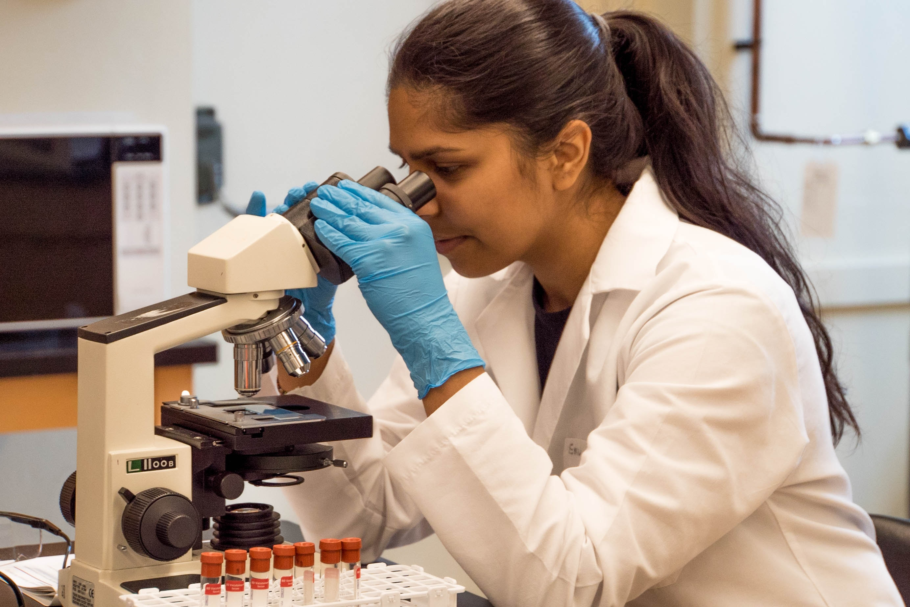
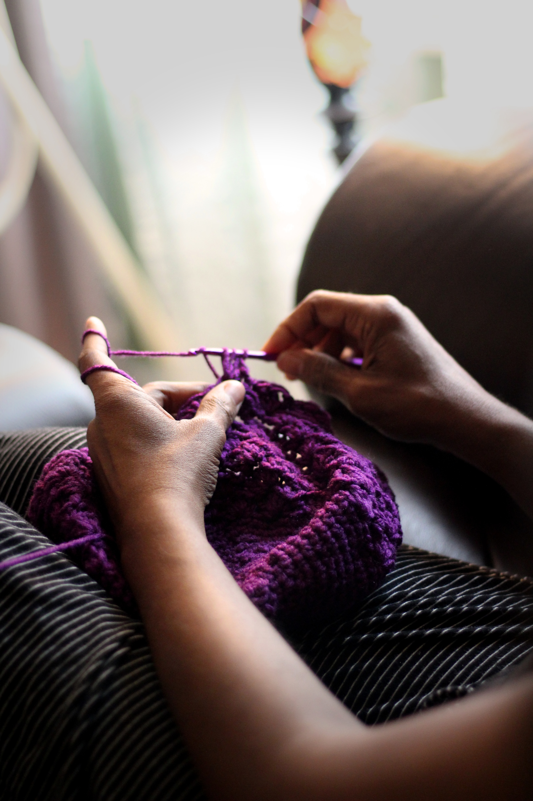

```{r setup, include=FALSE}
options(htmltools.dir.version = FALSE)
episode_counter <- 0
knitr::opts_chunk$set(
  collapse = TRUE,   
  comment = "#>"
)
options(knitr.table.format = "markdown")
```

```{r packages, include=FALSE}
library(countdown)
library(ymlthis)
library(tidyverse)
library(arsenal)
library(janitor)
```

```{r load-data, include=FALSE}
mockdata <- read_csv(here::here("static/slides/data/mockdata.csv")) %>%
  mutate(fu_fct = fct_recode(as.factor(fu_stat), 
                             "Lived" = "1", 
                             "Died" = "2")) %>% 
  mutate_at(vars(starts_with("ae_")), ~as.factor(.))
```


class: title-slide, left, middle
background-image: url("images/renoir.jpg")
background-position: right
background-size: contain
background-color: #0071B8

.pull-left[

# `r rmarkdown::metadata$title`

## `r rmarkdown::metadata$subtitle`

### `r rmarkdown::metadata$author` &#183; RStudio

#### [r3-rmedicine.netlify.app](https://r3-rmedicine.netlify.app)
]


---
class: middle, center

# <i class="fas fa-cloud"></i>

# Go here and log in (free):

`r params$cloud_link`

---
layout: true

<div class="my-footer"><span>`r params$cloud_link`</span></div>


---
class: top

.left-column[
<span class="fa-stack fa-4x">
  <i class="fa fa-circle fa-stack-2x" style="color: #2f5275;"></i>
  <strong class="fa-stack-1x" style="color: #fff;">?</strong>
</span> 

]


.right-column[

# How *does* Quarto work?

1. `r emo::ji("shrug")` (`r emo::ji("heavy_check_mark")`)

1. ["I press knit, a document appears, and I believe that anything happening in between could be actual magic."](https://twitter.com/allison_horst/status/1070323369600442368?s=20) (`r emo::ji("wizard")`)

1. `knitr` executes the code and converts `.Rmd` to `.md`; **Pandoc** renders the `.md` file to the output format you want. (`r emo::ji("heavy_check_mark")`)

]


---
class: your-turn


# Your turn

## Mad libs style &mdash; with a neighbor

```markdown
 ___________ is written at the top between `---` in ________.
    noun                                             syntax
                                                     
  ______ is written in Markdown.
   noun         
  
  ______ is written in R (or other programming language).
   noun   
   
  The ______ package evaluates the code and produces the ______.
       noun                                               noun
```

_psst: answers on next slide..._

```{r echo=FALSE}
countdown(minutes = 3)
```

---
class: your-turn


# Your turn

## Answers

```markdown
 Metadata is written at the top between `---` in YAML.
   (noun)                                      (syntax)
                                                     
  Text is written in Markdown.
 (noun)         
  
  Code is written in R (or other programming language).
 (noun)   
   
  The knitr package evaluates the code and produces the output.
     (noun)                                             (noun) 
```

---

# Your turn

Open up `02-progress.qmd`.

Look at the source, then render.

Answer the following questions:

1. What is the output **format**?

1. Are there any output **options**?

1. Are any `knitr` **execution** options set?

1. Anything in the code look foreign to you? 

1. Anything in the output (or not in the output) surprise you?

```{r echo = FALSE}
countdown(minutes = 5)
```

---
class: middle, center, inverse

<span class="fa-stack fa-4x">
  <i class="fa fa-circle fa-stack-2x" style="color: #fff;"></i>
  <strong class="fa-stack-1x" style="color:#2f5275;">`r (episode_counter <- episode_counter + 1)` </strong>
</span> 

--

# Output formats


---
class: middle, center

```{r echo=FALSE,out.width="50%"}
knitr::include_graphics("images/outputs.png")
```

???

Built in formats (in the `rmarkdown` package)

versus

extensions (different packages that extend output formats available to you)

---
class: middle, center


```{r echo=FALSE, out.width="40%", fig.link="https://rmarkdown.rstudio.com/docs/reference/index.html#section-output-formats"}
knitr::include_graphics("images/rmdbase-formats.png")
```

https://rmarkdown.rstudio.com/docs/reference/index.html#section-output-formats

---
class: your-turn

# Your turn

## Use a different built-in format

.pull-left[

Use the drop-down menu for the `r emo::ji("yarn")` **Knit** button and try:

1. Knit to Word

1. Knit to PDF

]

.pull-right[
```{r echo=FALSE, out.width="60%", fig.align="center"}
knitr::include_graphics("images/knit-dropdown.png")
```

]

```{r echo = FALSE}
countdown(minutes = 2)
```


---

# Temp check `r emo::ji("thermometer")`

Does your current YAML look like this?

```{r echo=FALSE}
yml_empty() %>% 
  yml_author("Your name here") %>% 
  yml_title("Your title here") %>% 
  yml_output(html_document(toc = TRUE, toc_float = TRUE, theme = "flatly"), 
             word_document(), 
             pdf_document()
             )  %>% 
  asis_yaml_output()
```

???

This is a great way to "control" your knit button!

Notice that when you knit, it respects those output options in your YAML.

This way you "save" your output options

---
class: your-turn

# Your turn

## Add output options with your YAML

.pull-left[

You just used the drop-down `r emo::ji("yarn")` **Knit** button to knit to Word and PDF. 

1. Change your YAML to the right...

1. Be __very careful__ about indentation and `:` here!!

1. `r emo::ji("yarn")` **Knit** to Word again- is there a TOC?

]

.pull-right[

```{r echo=FALSE}
yml_empty() %>% 
  yml_author("Your name here") %>% 
  yml_title("Your title here") %>% 
  yml_output(html_document(toc = TRUE, toc_float = TRUE, theme = "flatly"), 
             word_document(toc = TRUE), 
             pdf_document()
             ) %>% 
  asis_yaml_output()
```

]


```{r echo = FALSE}
countdown(minutes = 1)
```

---

# What is hard about YAML?

.pull-left[

]

.pull-right[
+ Indentations matter

+ Rarely informative error messages

+ Knowing which output options are relevant for different formats (i.e., Word, PDF, HTML, etc.)

+ Easy to forget the right `key`

+ Easy to forget the possible `values` for a given `key`
]

---
class: your-turn

# Your turn

## Answer

.pull-left[
```{r echo = FALSE}
yml_empty() %>% 
  yml_author("Your name here") %>% 
  yml_title("Your title here") %>% 
  yml_output(distill::distill_article()) %>% 
  asis_yaml_output()
```
]

.pull-right[
```{r echo = FALSE}
yml_empty() %>% 
  yml_author("Your name here") %>% 
  yml_title("Your title here") %>% 
  yml_output(distill::distill_article(toc = TRUE)) %>% 
  asis_yaml_output()
```
]

---
class: middle

# Pop quiz

.pull-left[
How do you add a single output **format** to your YAML?

```yaml
---
output: html_document: default
---
output: html_document
---
```

]

--

.pull-right[
How do you add an output **option** to a format in your YAML?

```yaml
---
output: 
  html_document: 
    toc: true
---
output: 
  html_document(toc=true)
---
```

]

---
class: middle

# Pop quiz

.pull-left[
How do you add another output **format** to your YAML?

```yaml
---
output: 
  html_document: default
  word_document: default
---
output: 
  html_document()
  word_document()
---
```

]

--


.pull-right[
How do you now add output **options** to your YAML?

```yaml
---
output: 
  html_document: 
    toc: true
  word_document: default
---
output: 
  html_document(toc=true)
  word_document(default)
---
```

]

---
class: middle, center, inverse

# Tables


---
class: middle, center, inverse

<span class="fa-stack fa-4x">
  <i class="fa fa-circle fa-stack-2x" style="color: #fff;"></i>
  <strong class="fa-stack-1x" style="color:#2f5275;">`r (episode_counter <- episode_counter + 1)` </strong>
</span> 

--

# Custom typed tables


---
class: center

# Markdown tables

.pull-left[

```markdown
| Time          | Session | Topic    |
|:--------------|:-------:|---------:|
| _left_        | _center_| _right_  |
| 01:00 - 01:50 | 1       | Anatomy  |
| 01:50 - 02:00 |         | *Break*  |
| 02:00 - 02:45 | 2       | Tables   |
| 02:45 - 03:00 |         | *Break*  |

```
]

--

.pull-right[

| Time          | Session | Topic    |
|:--------------|:-------:|---------:|
| _left_        | _center_| _right_  |
| 01:00 - 01:50 | 1       | Anatomy  |
| 01:50 - 02:00 |         | *Break*  |
| 02:00 - 02:45 | 2       | Tables   |
| 02:45 - 03:00 |         | *Break*  |

]

---
class: your-turn

# Your turn

## Type up a Markdown table

Find this section:

```markdown
<--TODO: add markdown table of treatment arms here-->
```

.pull-left[

Using pipes `|`, make this table:

| Arm | Drug   |
|:----|:-------|
| A   | IFL    |
| F   | FOLFOX |
| G   | IROX   |

]

.pull-right[


]

_psst...answers on the next slide..._

```{r echo=FALSE}
countdown(minutes = 3)
```

---
class: your-turn

# Your turn

## Answers

.pull-left[
```markdown
| Arm | Drug   |
|:----|:-------|
| A   | IFL    |
| F   | FOLFOX |
| G   | IROX   |
```
]

.pull-right[
```markdown
|Arm|Drug|
|:---|:---|
|A|IFL|
|F|FOLFOX|
|G|IROX|
```
]

Spacing actually doesn't matter - it mainly helps your eyeballs.

---
class: center, middle

# Two table types


.pull-left[

### for your eyes mainly

```{r echo=FALSE}

```


]

--

.pull-right[

### for other people's eyes too

```{r echo=FALSE}
knitr::include_graphics("images/tables-them.jpg")
```
]

---

.pull-left[


]

.pull-right[

]

.footnote[Images from [Unsplash](https://unsplash.com/photos/_TuIdedBPwQ) and [Wikipedia](https://commons.wikimedia.org/wiki/File:FIAT_500L_gear_shift.jpg)]

---
class: middle, center, inverse

<span class="fa-stack fa-4x">
  <i class="fa fa-circle fa-stack-2x" style="color: #fff;"></i>
  <strong class="fa-stack-1x" style="color:#2f5275;">`r (episode_counter <- episode_counter + 1)` </strong>
</span> 

--

# EDA Tables

---

# Let's try using data now

```{r ref.label='load-data'}
```

---

# EDA tables: `janitor`

Good for 1- and 2-way frequency tables with categorical variables

Count number of participants by `arm`, then add by status (`fu_fct`) too

.pull-left[

```{r}
mockdata %>% 
  tabyl(arm)
```

] 

--

.pull-right[

```{r}
mockdata %>% 
  tabyl(arm) %>% 
  adorn_totals("row") %>%
  adorn_pct_formatting()
```

]

---

.pull-left[

````
```{r results='asis'}`r ''`
mockdata %>% 
  tabyl(arm, fu_fct) %>%
  knitr::kable()
```
````

```{r results='asis', echo=FALSE}
mockdata %>% 
  tabyl(arm, fu_fct) %>%
  knitr::kable()
```

] 

--

.pull-right[

````
```{r results='asis'}`r ''`
mockdata %>% 
  tabyl(arm, fu_fct) %>% 
  adorn_totals("row") %>%
  adorn_percentages("row") %>%
  adorn_pct_formatting(digits = 2) %>%
  adorn_ns() %>%
  knitr::kable()
```
````

```{r results='asis', echo=FALSE}
mockdata %>% 
  tabyl(arm, fu_fct) %>% 
  adorn_totals("row") %>%
  adorn_percentages("row") %>%
  adorn_pct_formatting(digits = 2) %>%
  adorn_ns() %>%
  knitr::kable()
```

]

---
class: your-turn

# Your turn

## Fix this `tabyl`

Find this section:
```markdown
<--TODO: make this print better with knitr::kable + code chunks-->
```

Make this `tabyl` print nicely when knitted.

```{r results='hide'}
mockdata %>% 
  tabyl(arm) %>% 
  adorn_totals("row") %>%
  adorn_pct_formatting() 
```

_psst: answers on next slide..._

```{r echo=FALSE}
countdown(minutes = 3)
```

---
class: your-turn

# Answer

````
```{r results='asis'}`r ''`
mockdata %>% 
  tabyl(arm) %>% 
  adorn_totals("row") %>%
  adorn_pct_formatting() %>% 
  knitr::kable()
```
````

```{r results='asis', echo=FALSE}
mockdata %>% 
  tabyl(arm) %>% 
  adorn_totals("row") %>%
  adorn_pct_formatting() %>% 
  knitr::kable()
```

---
class: middle, center, inverse

<span class="fa-stack fa-4x">
  <i class="fa fa-circle fa-stack-2x" style="color: #fff;"></i>
  <strong class="fa-stack-1x" style="color:#2f5275;">`r (episode_counter <- episode_counter + 1)` </strong>
</span> 

---

---
class: middle

.left-column[

```{r out.width='50%', echo=FALSE}
knitr::include_graphics("https://raw.githubusercontent.com/rstudio/gt/master/man/figures/logo.svg")
```

]

.right-column[
# the gt package

<https://gt.rstudio.com/>
]

---
background-image: url(https://gt.rstudio.com/reference/figures/gt_parts_of_a_table.svg)
background-size: contain

---
background-image: url(https://gt.rstudio.com/reference/figures/gt_workflow_diagram.svg)
background-size: contain

---
class: middle

.pull-left[
```{r}
mockdata %>%
  count(arm) %>% 
  gt::gt()
```
]

--

.pull-right[
```{r}
mockdata %>%
  count(arm, sex) %>% 
  pivot_wider(names_from = sex, 
              values_from = n) %>% 
  gt::gt()
```

]

---
class: middle

.left-column[


]

.right-column[
# the gtsummary package

<http://www.danieldsjoberg.com/gtsummary/index.html>
]

---
class: middle

# Simple frequency table

```{r}
library(gtsummary)
mockdata %>%
  select(arm) %>% 
  tbl_summary()
```

---

## Cross-tables

.pull-left[

```{r}
mockdata %>%
  select(fu_fct, arm) %>% 
  tbl_summary(by = fu_fct)
```
]

--

.pull-right[

```{r}
mockdata %>%
  select(fu_fct, arm) %>% 
  tbl_cross(
    row = arm,
    col = fu_fct,
    percent = "cell",
    label = fu_fct ~ "Follow-up")
```
]


---
class: middle

## A `tbl_summary()`

.left-column[
```{r sum-tbl, results='hide', warning=FALSE, message=FALSE}
mockdata %>% 
  select(arm, sex) %>% 
  tbl_summary(by = arm) %>% 
  add_p() %>% 
  add_overall()
```
]

.right-column[
```{r ref.label='sum-tbl', echo=FALSE}

```

]

---
class: middle

# A bigger `tbl_summary()`

.left-column[

```{r big-sum-tbl, results='hide', warning=FALSE, message=FALSE}
mockdata %>% 
  select(arm, 
         starts_with("ae")) %>% 
  tbl_summary(by = arm)  
```
]

.right-column[
```{r ref.label='big-sum-tbl', echo=FALSE}

```

]

---
class: middle, center, inverse

<span class="fa-stack fa-4x">
  <i class="fa fa-circle fa-stack-2x" style="color: #fff;"></i>
  <strong class="fa-stack-1x" style="color:#2f5275;">`r (episode_counter <- episode_counter + 1)` </strong>
</span> 

--

# Table One

---

```{r}
mockdata %>% 
  select(age, fu_fct) %>% 
  tbl_summary()
```

```{r}
mockdata %>% 
  select(sex, age, bmi, arm) %>% 
  tbl_summary(by = arm) %>% 
  add_p()
```

---

```{r}
mockdata %>% 
  select(sex, age, bmi, arm) %>% 
  tbl_summary(by = arm, 
              type = all_continuous() ~ "continuous2") %>% 
  add_p()
```


---
class: your-turn

# Your turn

## Make an adverse events table

Find this section:

```markdown
<!--TODO: add adverse events table-->
```

1. When you select variables, add all that start with "ae" (hint: `starts_with("string"))`.

1. Make the table grouped by treatment arm.


```{r echo=FALSE}
countdown(minutes = 3)
```


---
class: middle, center

# `r emo::ji("stopwatch")`

# Time for a break!

```{r echo = FALSE}
countdown(minutes = 15, update_every = 15)
```
